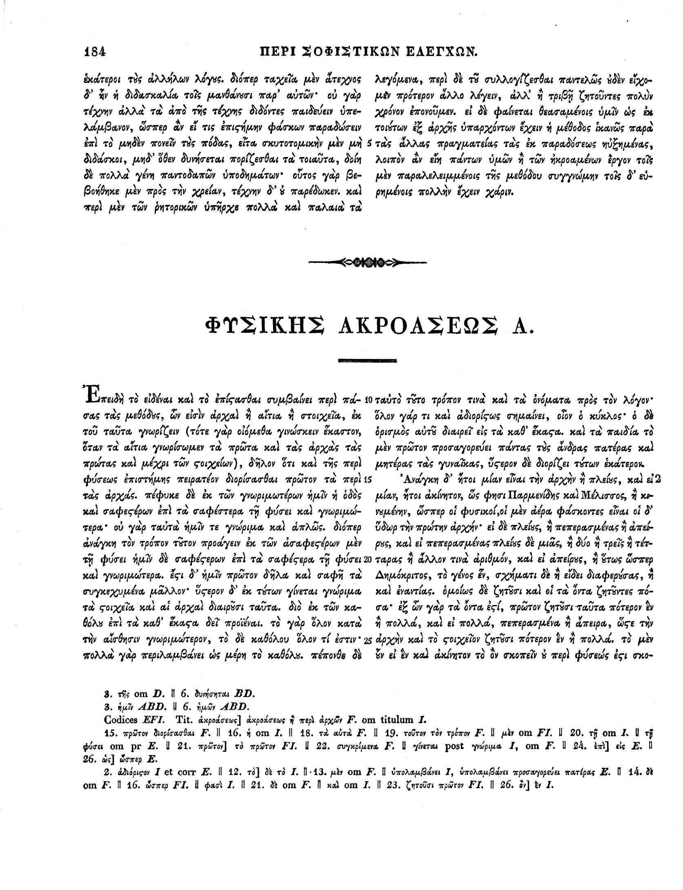

# 📚 Source Analysis System

<div align="center">
  
  
  
  <h2>Computational Approaches to Philosophical Text Analysis</h2>
  
  <p><em>Bridging ancient wisdom and modern AI</em></p>
  
  <p>
    <a href="#overview">Overview</a> •
    <a href="#problem">Problem Statement</a> •
    <a href="#pipeline">Pipeline</a> •
    <a href="#stage1">Thematizer</a> •
    <a href="#stage2">Source Analyzer</a> •
    <a href="#stage3">Deep Analyzer</a> •
    <a href="#significance">Significance</a>
  </p>
  
  <br>
  
  <p><em>Arabic manuscript from Bodleian Library (MS. Arab.d.84)</em></p>
</div>

---

<a id="overview"></a>
## 🔍 Overview

<div align="center">
  <table>
    <tr>
      <td align="center" width="33%"><h3>🔍 Discover</h3>Hidden textual connections</td>
      <td align="center" width="33%"><h3>🔄 Compare</h3>Cross-linguistic influences</td>
      <td align="center" width="33%"><h3>📊 Analyze</h3>Evidence-based relationships</td>
    </tr>
  </table>
</div>

<br>

The Source Analysis System is a sophisticated computational pipeline designed to analyze philosophical texts, identify thematic connections, and trace potential influences between ancient works. This system combines natural language processing, machine learning, and classical scholarship to provide evidence-based insights into textual relationships that might otherwise remain hidden.

---

<a id="problem"></a>
## ⚠️ Problem Statement

<table>
  <tr>
    <td width="70%">
      <h3>Challenges in Traditional Analysis</h3>
      <ul>
        <li><strong>Labor-Intensive Process:</strong> Tracing the transmission of ideas across philosophical traditions requires extensive manual effort</li>
        <li><strong>Human Limitations:</strong> Individual scholars can only process a finite amount of text</li>
        <li><strong>Subjective Biases:</strong> Manual analysis is influenced by individual scholar perspectives</li>
        <li><strong>Cross-Linguistic Barriers:</strong> Comparing texts across languages adds significant complexity</li>
      </ul>
      <h3>Our Solution</h3>
      <p>Leverage AI to augment scholarly analysis while maintaining rigorous academic standards</p>
    </td>
    <td width="30%" align="center">
      
      <p><em>Immanuel Bekker (1785-1871)<br>Classical philologist whose work exemplifies traditional source analysis</em></p>
    </td>
  </tr>
</table>

---

<a id="pipeline"></a>
## ⚙️ Three-Stage Pipeline

Our system employs a sophisticated three-stage pipeline that progressively refines the analysis:

<div align="center">
  <table>
    <tr>
      <th width="20%">Stage</th>
      <th width="40%">Focus</th>
      <th width="40%">Output</th>
    </tr>
    <tr>
      <td align="center"><h3>1️⃣</h3><strong>Thematizer</strong></td>
      <td>Individual text analysis</td>
      <td>Thematic profiles</td>
    </tr>
    <tr>
      <td align="center"><h3>2️⃣</h3><strong>Source Analyzer</strong></td>
      <td>Pairwise comparison</td>
      <td>Relationship evidence</td>
    </tr>
    <tr>
      <td align="center"><h3>3️⃣</h3><strong>Deep Analyzer</strong></td>
      <td>In-depth analysis</td>
      <td>Detailed influence assessment</td>
    </tr>
  </table>
</div>

<br>

The following sections demonstrate each stage of the pipeline with concrete examples of inputs, processes, and outputs for each stage, starting with the Thematizer.

---

<a id="stage1"></a>
## 🧠 Stage 1: Thematizer

<div align="center">
  
  <p><em>Page from Bekker's edition of Aristotle's works (1831), showing the type of texts analyzed by our system</em></p>
</div>

### Purpose

The Thematizer performs initial broad analysis of individual texts to identify themes, structure, and key concepts. It serves as the foundation for all subsequent analysis by creating comprehensive thematic profiles for each text.

### Input Example: Classical Arabic Text (Al-Farabi)

<div align="center">
  <table>
    <tr>
      <td>
        <pre>
وأما الشعر فإنه كلام مخيل مؤلف من أقوال لها إيقاعات متساوية، وهذه الأقوال 
متساوية الأجزاء عند العرب متفقة الأواخر، وعند اليونانيين متساوية في الأزمنة 
متفقة الأوزان، وكل قول منها عند العرب يسمى بيتا، وعند اليونانيين يسمى الواحد 
منها فاصلة، وعند كثير من الأمم يسمى الواحد منها سطرا.
        </pre>
      </td>
    </tr>
    <tr>
      <td align="center"><em>Classical Arabic text from Al-Farabi's "Risālah fī qawānīn ṣināʿat al-šuʿarāʾ"</em></td>
    </tr>
  </table>
</div>

### Process

The Thematizer follows these steps:

1. **Text Preparation**
   - Ingests raw text files from input and database directories
   - Validates file structure and creates organized directory for outputs
   - Splits large texts into manageable chunks (approximately 20,000 characters)

2. **AI Analysis**
   - Processes each text chunk using Claude 3.5 Sonnet
   - Applies specialized prompt engineering for philosophical text analysis
   - Identifies author, title, text type, themes, and structural elements
   - Generates scholarly abstracts for each text chunk

3. **Result Compilation**
   - Merges analyses from multiple chunks with intelligent deduplication
   - Combines abstracts and consolidates themes
   - Identifies natural breaks and section divisions
   - Generates comprehensive thematic profiles

### AI Prompt Used

<div align="center">
  <table>
    <tr>
      <td>
        <pre>
You are a Classical scholar specializing in ancient Greek and Arabic philosophy. 
You are analyzing an academic philosophical text that could be:
1. An ancient Greek philosophical work (like Aristotle's originals)
2. An Arabic philosophical text (like Al-Farabi's originals)
3. A commentary or interpretation of philosophical works
4. Part of the established philosophical canon

Please analyze the following chunk and extract:

1. Author identification
2. Title identification
3. Text type classification
4. Themes and concepts
5. Abstract focusing on main philosophical arguments
6. Structural elements

You MUST respond in valid JSON format with these exact fields:
{
    "author": "Author's name or 'Unknown' if not found in this chunk",
    "title": "Title of the work or 'Unknown' if not found in this chunk",
    "text_type": "original text|commentary|treatise|unknown",
    "themes": ["theme1", "theme2", ...],
    "abstract": "A scholarly abstract of this chunk of text.",
    "natural_breaks": ["Break 1", "Break 2", ...] or [] if none found
}
        </pre>
      </td>
    </tr>
  </table>
</div>

### Output Example

<div align="center">
  <table>
    <tr>
      <td>
        <pre>
{
  "summary": "Al-Farabi's text presents a systematic analysis of poetics, 
  defining poetry as imaginative discourse with rhythmic patterns. It 
  compares Arabic and Greek poetic traditions, highlighting differences 
  in metrical systems while identifying universal elements of poetic 
  composition. The text establishes a philosophical framework for 
  understanding poetry as a form of logical discourse with specific 
  effects on the soul.",
  
  "themes": [
    "Definition and nature of poetry",
    "Comparative poetics (Arabic vs. Greek traditions)",
    "Metrical systems and rhythmic patterns",
    "Imaginative discourse and its effects",
    "Poetry as logical argumentation",
    "Classification of poetic forms",
    "Relationship between poetry and truth"
  ],
  
  "key_concepts": {
    "takhyīl (imagination)": "The quality of discourse that evokes images 
    in the mind of the listener, central to poetic effect",
    "wazn (meter)": "The rhythmic pattern that organizes poetic discourse 
    into measurable units",
    "qawl (statement)": "The basic unit of poetic composition, equivalent 
    to a verse or line",
    "īqāʿāt (rhythms)": "Regular patterns of sound that create the musical 
    quality of poetry",
    "qiyās shiʿrī (poetic syllogism)": "A form of logical argument that 
    operates through imaginative rather than demonstrative means"
  },
  
  "structure": [
    {"section": "Definition of Poetry", "function": "Establishes the essential 
    nature of poetic discourse"},
    {"section": "Comparative Analysis", "function": "Contrasts Arabic and Greek 
    poetic traditions"},
    {"section": "Metrical Theory", "function": "Explains the technical aspects 
    of poetic composition"},
    {"section": "Psychological Effects", "function": "Analyzes how poetry 
    affects the soul through imagination"},
    {"section": "Classification System", "function": "Categorizes types of 
    poetry by form and function"}
  ],
  
  "tradition": "Islamic Peripatetic philosophy with strong Aristotelian influence",
  
  "potential_influences": [
    {"source": "Aristotle's Poetics", "confidence": "High", 
     "evidence": "Conceptual framework, terminology, and analytical approach"},
    {"source": "Aristotle's Organon", "confidence": "Medium", 
     "evidence": "Logical framework and syllogistic approach"},
    {"source": "Arabic poetic tradition", "confidence": "High", 
     "evidence": "Technical terminology and metrical analysis"}
  ]
}
        </pre>
      </td>
    </tr>
  </table>
</div>

### Key Features

- **Multilingual Analysis**: Processes texts in Ancient Greek, Classical Arabic, and other languages
- **Intelligent Chunking**: Handles texts of any length by splitting into manageable chunks while preserving context
- **Structured Output**: Generates standardized JSON data for consistent downstream processing
- **Error Handling**: Implements robust retry logic and error recovery mechanisms
- **Comprehensive Logging**: Maintains detailed logs for transparency and debugging

---

<a id="stage2"></a>
## 🔍 Stage 2: Source Analyzer

### Purpose

The Source Analyzer compares texts to identify potential relationships and influences between them. It takes the thematic profiles generated by the Thematizer and performs pairwise comparisons to detect verbal parallels, conceptual similarities, and methodological connections.

### Input Example

The Source Analyzer takes two thematic profiles as input:

1. **Text A (Potential Source)**: Thematic profile of Aristotle's "Poetics"
```json
{
  "author": "Aristotle",
  "title": "Poetics",
  "text_type": "original text",
  "themes": [
    "Mimesis (imitation) as the foundation of poetry",
    "Classification of poetic forms (tragedy, comedy, epic)",
    "Structure and elements of tragedy",
    "Catharsis as emotional purification",
    "Unity of plot and action",
    "Character development in drama",
    "Relationship between poetry and truth"
  ],
  "abstract": "Aristotle's Poetics establishes a systematic theory of poetry and drama, focusing primarily on tragedy. The text defines poetry as mimesis (imitation) and analyzes how different poetic forms imitate reality through various means. Aristotle examines the structure of tragedy, identifying its six essential components: plot, character, thought, diction, melody, and spectacle. He emphasizes the primacy of plot and the importance of unity, completeness, and magnitude in dramatic composition. The work also discusses the psychological effects of tragedy, introducing the concept of catharsis as emotional purification through pity and fear."
}
```

2. **Text B (Text Under Analysis)**: Thematic profile of Al-Farabi's "Risālah fī qawānīn ṣināʿat al-šuʿarāʾ"
```json
{
  "author": "Al-Farabi",
  "title": "Risālah fī qawānīn ṣināʿat al-šuʿarāʾ",
  "text_type": "treatise",
  "themes": [
    "Definition and nature of poetry",
    "Comparative poetics (Arabic vs. Greek traditions)",
    "Metrical systems and rhythmic patterns",
    "Imaginative discourse and its effects",
    "Poetry as logical argumentation",
    "Classification of poetic forms",
    "Relationship between poetry and truth"
  ],
  "abstract": "Al-Farabi's text presents a systematic analysis of poetics, defining poetry as imaginative discourse with rhythmic patterns. It compares Arabic and Greek poetic traditions, highlighting differences in metrical systems while identifying universal elements of poetic composition. The text establishes a philosophical framework for understanding poetry as a form of logical discourse with specific effects on the soul."
}
```

### Process Workflow

The Source Analyzer follows a systematic workflow to compare texts and assess potential influence:

<div align="center">
  <table>
    <tr>
      <th>Step</th>
      <th>Action</th>
      <th>Purpose</th>
    </tr>
    <tr>
      <td>1</td>
      <td>Load thematic profiles</td>
      <td>Retrieve structured data from Thematizer outputs</td>
    </tr>
    <tr>
      <td>2</td>
      <td>Identify shared themes</td>
      <td>Detect overlapping philosophical concepts</td>
    </tr>
    <tr>
      <td>3</td>
      <td>Extract key passages</td>
      <td>Locate specific textual evidence for comparison</td>
    </tr>
    <tr>
      <td>4</td>
      <td>Analyze verbal parallels</td>
      <td>Compare terminology, phrasing, and examples</td>
    </tr>
    <tr>
      <td>5</td>
      <td>Analyze conceptual parallels</td>
      <td>Compare ideas, arguments, and frameworks</td>
    </tr>
    <tr>
      <td>6</td>
      <td>Analyze methodological similarities</td>
      <td>Compare approaches, structures, and reasoning patterns</td>
    </tr>
    <tr>
      <td>7</td>
      <td>Calculate confidence score</td>
      <td>Quantify likelihood of influence (0.0-1.0)</td>
    </tr>
    <tr>
      <td>8</td>
      <td>Generate evidence summary</td>
      <td>Provide detailed justification for assessment</td>
    </tr>
  </table>
</div>

### Technical Implementation

The Source Analyzer is implemented as a Python module that:

1. **Loads and Validates Data**
   - Reads JSON outputs from the Thematizer
   - Validates data structure and required fields
   - Prepares text pairs for comparison

2. **Performs AI-Powered Analysis**
   - Constructs specialized prompts for Claude 3.5 Sonnet
   - Sends paired texts for comparative analysis
   - Processes and validates AI responses

3. **Generates Structured Results**
   - Creates standardized JSON output
   - Calculates confidence scores based on multiple factors
   - Organizes evidence by category (verbal, conceptual, methodological)

### AI Prompt Used

<div align="center">
  <table>
    <tr>
      <td>
        <pre>
You are a comparative philosophical analyst with expertise in identifying textual relationships 
between ancient Greek and Arabic philosophical works. Your task is to compare two philosophical 
texts and assess potential influence or relationship.

TEXT A (Potential Source):
{
  "author": "{{text_a.author}}",
  "title": "{{text_a.title}}",
  "text_type": "{{text_a.text_type}}",
  "themes": {{text_a.themes|json}},
  "abstract": "{{text_a.abstract}}"
}

TEXT B (Text Under Analysis):
{
  "author": "{{text_b.author}}",
  "title": "{{text_b.title}}",
  "text_type": "{{text_b.text_type}}",
  "themes": {{text_b.themes|json}},
  "abstract": "{{text_b.abstract}}"
}

Please analyze these texts for evidence of influence or relationship, focusing on:

1. Verbal parallels:
   - Similar terminology or phrasing
   - Shared examples or illustrations
   - Comparable definitions of key concepts

2. Conceptual parallels:
   - Similar philosophical ideas or arguments
   - Comparable theoretical frameworks
   - Shared philosophical problems or questions

3. Methodological similarities:
   - Similar analytical approaches
   - Comparable organizational structures
   - Shared reasoning patterns or logical methods

4. Influence assessment:
   - Evaluate the likelihood of direct influence (scale 0.0-1.0)
   - Consider historical context and transmission pathways
   - Assess alternative explanations for similarities

Provide specific evidence for each category and explain your confidence score.
Format your analysis as structured JSON with these exact fields:
"verbal_parallels", "conceptual_parallels", "methodological_similarities", 
"influence_score", "evidence", "confidence_explanation"
        </pre>
      </td>
    </tr>
  </table>
</div>

### Output Example: Detailed Comparison Analysis

<div align="center">
  <table>
    <tr>
      <td>
        <pre>
{
  "verbal_parallels": [
    {
      "concept": "Mimesis/Takhyīl",
      "text_a": "Aristotle defines poetry fundamentally as mimesis (μίμησις), 
                the imitation or representation of reality through artistic means",
      "text_b": "Al-Farabi establishes takhyīl (تخييل) as the central concept, 
                defining it as imaginative representation that creates images 
                in the mind of the listener",
      "analysis": "Both texts center their poetic theories on representational 
                  concepts, with Aristotle's mimesis and Al-Farabi's takhyīl 
                  serving analogous functions despite subtle differences in scope"
    },
    {
      "concept": "Poetic Forms Classification",
      "text_a": "Aristotle systematically categorizes poetry into tragedy, comedy, 
                and epic poetry, defining each by its means, objects, and manner 
                of imitation",
      "text_b": "Al-Farabi presents a classification system that acknowledges Greek 
                categories while incorporating Arabic forms like madīḥ (praise), 
                hijāʾ (satire), and rithāʾ (elegy)",
      "analysis": "Both authors employ taxonomic approaches to poetic forms, 
                  though Al-Farabi adapts the classification to accommodate 
                  Arabic literary traditions"
    },
    {
      "concept": "Technical Terminology",
      "text_a": "Aristotle employs specialized vocabulary including μῦθος (plot), 
                λέξις (diction), and κάθαρσις (catharsis)",
      "text_b": "Al-Farabi uses corresponding technical terms including ḥikāya 
                (narrative), lafẓ (verbal expression), and taṭhīr (purification)",
      "analysis": "The technical vocabulary shows clear correspondences that 
                  suggest deliberate translation or adaptation of Aristotelian 
                  terminology into Arabic philosophical language"
    }
  ],
  
  "conceptual_parallels": [
    {
      "concept": "Poetry as Logical Discourse",
      "text_a": "Aristotle integrates poetry into his broader philosophical system, 
                treating it as a form of knowledge with its own logical structure",
      "text_b": "Al-Farabi explicitly develops the concept of 'poetic syllogism' 
                (qiyās shiʿrī), positioning poetry within his logical framework 
                derived from Aristotle's Organon",
      "analysis": "Al-Farabi extends Aristotle's approach by more explicitly 
                  connecting poetics to formal logic, developing what was implicit 
                  in Aristotle into a systematic theory of poetic reasoning"
    },
    {
      "concept": "Psychological Effect of Poetry",
      "text_a": "Aristotle's theory of catharsis describes how tragedy produces 
                emotional purification through the arousal and resolution of 
                pity and fear",
      "text_b": "Al-Farabi analyzes how poetic discourse affects the soul through 
                imagination, creating emotional responses that can lead to 
                ethical improvement",
      "analysis": "Both philosophers are concerned with poetry's psychological 
                  impact, though Al-Farabi adapts the concept to fit within 
                  Islamic philosophical psychology"
    },
    {
      "concept": "Unity and Structure",
      "text_a": "Aristotle emphasizes the importance of unity, completeness, and 
                magnitude in tragic plots, arguing that a well-constructed plot 
                should have a beginning, middle, and end",
      "text_b": "Al-Farabi discusses structural principles for poetic composition, 
                emphasizing coherence and proportionality in relation to the 
                intended effect",
      "analysis": "Both texts present normative theories of poetic structure, 
                  though Al-Farabi's approach is more explicitly connected to 
                  the logical structure of arguments"
    }
  ],
  
  "methodological_similarities": [
    {
      "approach": "Analytical Framework",
      "similarity": "Both texts approach poetry as a subject for philosophical 
                    analysis rather than purely aesthetic appreciation, 
                    integrating poetics into broader philosophical systems",
      "significance": "Indicates shared intellectual methodology characteristic 
                      of Peripatetic tradition, suggesting Al-Farabi's conscious 
                      positioning within this philosophical lineage"
    },
    {
      "approach": "Comparative Analysis",
      "similarity": "Al-Farabi adopts Aristotle's comparative approach but extends 
                    it to include Arabic poetic traditions, explicitly comparing 
                    Greek and Arabic metrical systems and poetic forms",
      "significance": "Shows adaptation of Aristotelian methodology to new cultural 
                      context while maintaining the fundamental analytical approach"
    },
    {
      "approach": "Definition and Division",
      "similarity": "Both authors begin with general definitions of poetry and 
                    proceed by division into types and analysis of components, 
                    following the classical method of definition by genus and 
                    specific difference",
      "significance": "Demonstrates Al-Farabi's adoption of Aristotelian logical 
                      methods in structuring his treatise"
    }
  ],
  
  "influence_score": 0.85,
  
  "evidence": [
    "Terminological correspondences between key concepts (mimesis/takhyīl, 
     catharsis/taṭhīr)",
    "Structural similarities in analytical approach and organization",
    "Adaptation of Aristotelian concepts to Arabic poetic tradition",
    "Integration with broader Peripatetic philosophical framework",
    "Historical evidence of transmission through Syriac translations",
    "Al-Farabi's explicit references to 'the author of the book on poetry'",
    "Consistent pattern of creative adaptation rather than mere imitation"
  ],
  
  "confidence_explanation": "The high confidence score (0.85) is based on multiple 
  lines of evidence including terminological, conceptual, methodological, and 
  historical factors. The pattern of similarities shows systematic engagement 
  with Aristotle's text, while the adaptations and extensions demonstrate 
  Al-Farabi's creative interpretation rather than coincidental similarity. 
  Historical evidence confirms that Al-Farabi had access to Aristotle's Poetics 
  through the translation tradition, and his other works show similar patterns 
  of engagement with Aristotelian texts. The score is not higher (e.g., 0.95) 
  because some similarities could be attributed to shared philosophical tradition 
  rather than direct textual influence, and because Al-Farabi introduces 
  significant innovations not found in Aristotle."
}
        </pre>
      </td>
    </tr>
  </table>
</div>

### Confidence Score Calculation

The Source Analyzer calculates confidence scores based on a weighted combination of factors:

<div align="center">
  <table>
    <tr>
      <th>Factor</th>
      <th>Weight</th>
      <th>Description</th>
    </tr>
    <tr>
      <td>Verbal Parallels</td>
      <td>30%</td>
      <td>Similarity in terminology, phrasing, and examples</td>
    </tr>
    <tr>
      <td>Conceptual Parallels</td>
      <td>35%</td>
      <td>Similarity in ideas, arguments, and frameworks</td>
    </tr>
    <tr>
      <td>Methodological Similarities</td>
      <td>20%</td>
      <td>Similarity in approach, structure, and reasoning</td>
    </tr>
    <tr>
      <td>Historical Context</td>
      <td>15%</td>
      <td>Known transmission pathways and historical evidence</td>
    </tr>
  </table>
</div>

### Results Visualization

The Source Analyzer generates visualizations to help scholars understand the relationships between texts:

<div align="center">
  <table>
    <tr>
      <th colspan="3">Influence Confidence Matrix</th>
    </tr>
    <tr>
      <th>Source Text</th>
      <th>Target Text</th>
      <th>Confidence Score</th>
    </tr>
    <tr>
      <td>Aristotle: Poetics</td>
      <td>Al-Farabi: Risālah fī qawānīn ṣināʿat al-šuʿarāʾ</td>
      <td><strong>0.85</strong></td>
    </tr>
    <tr>
      <td>Aristotle: Analytica Posteriora</td>
      <td>Al-Farabi: Risālah fī qawānīn ṣināʿat al-šuʿarāʾ</td>
      <td><strong>0.40</strong></td>
    </tr>
    <tr>
      <td>Plato: Republic (Books II-III)</td>
      <td>Al-Farabi: Risālah fī qawānīn ṣināʿat al-šuʿarāʾ</td>
      <td><strong>0.25</strong></td>
    </tr>
    <tr>
      <td>Arabic Poetic Tradition</td>
      <td>Al-Farabi: Risālah fī qawānīn ṣināʿat al-šuʿarāʾ</td>
      <td><strong>0.70</strong></td>
    </tr>
  </table>
</div>

### Key Features

- **Cross-Linguistic Analysis**: Compares texts across different languages and traditions
- **Evidence-Based Assessment**: Provides specific textual evidence for each claim
- **Confidence Scoring**: Quantifies the likelihood of influence on a standardized scale
- **Multi-Dimensional Analysis**: Examines verbal, conceptual, and methodological parallels
- **Historical Contextualization**: Considers known transmission pathways and historical factors

---

<a id="stage3"></a>
## 🔬 Stage 3: Deep Analyzer

### Purpose

The Deep Analyzer performs in-depth analysis of high-confidence matches identified by the Source Analyzer. It focuses on text pairs with high confidence scores (≥0.7) and provides detailed evidence-based assessment of influence patterns.

### Input Example

The Deep Analyzer takes as input the results from the Source Analyzer:

```json
{
  "comparisons": [
    {
      "input_file": "aristotle_poetics.txt",
      "database_file": "alfarabi_poetics.txt",
      "relevance_score": 0.85,
      "analysis": {
        "verbal_parallels": ["..."],
        "conceptual_parallels": ["..."],
        "methodological_parallels": ["..."],
        "technical_vocabulary": ["..."],
        "analysis_summary": "...",
        "confidence_score": 0.85,
        "recommended_research": ["..."]
      }
    }
  ]
}
```

### Process

The Deep Analyzer follows these steps:

1. **Load Previous Analysis**
   - Retrieves results from the Source Analyzer
   - Filters for high-confidence comparisons (≥0.7)

2. **Analyze Transmission Patterns**
   - Examines direct textual dependencies
   - Identifies conceptual dependencies
   - Looks for evidence of mediation
   - Identifies adaptation indicators

3. **Analyze Philosophical Development**
   - Examines argument structure
   - Analyzes conceptual frameworks
   - Evaluates methodological approaches
   - Identifies philosophical innovations

4. **Analyze Linguistic Transformation**
   - Examines technical terminology
   - Analyzes argumentative language
   - Evaluates conceptual expression
   - Identifies textual organization patterns

5. **Generate Comprehensive Report**
   - Combines all analyses
   - Calculates aggregate confidence scores
   - Provides detailed evidence for each finding

### Technical Implementation

The Deep Analyzer is implemented as a Python module that:

1. **Loads Source Analyzer Results**
   - Retrieves the latest analysis results
   - Filters for high-confidence matches (≥0.7)

2. **Makes API Calls to OpenAI**
   - Uses the o3-mini model
   - Implements retry logic for reliability
   - Processes structured JSON responses

3. **Performs Three Types of Analysis**
   - Transmission pattern analysis
   - Philosophical development analysis
   - Linguistic transformation analysis

4. **Generates Detailed Reports**
   - Creates comprehensive analysis reports
   - Saves results with timestamps
   - Maintains symlinks to latest results

### AI Prompt Example

Here's an example of the prompt used for transmission pattern analysis:

```
Analyze the textual evidence for transmission and influence between these texts:

Text 1:
Author: [Author]
Title: [Title]
Type: [Text Type]

Text 2:
Database Text: [Database File]

Existing Analysis:
[Previous Analysis JSON]

Please analyze the concrete textual evidence for:
1. Direct textual dependencies:
   - Exact quotations or close paraphrases
   - Shared examples or illustrations
   - Similar structural organization
   - Common reference points

2. Conceptual dependencies:
   - Shared philosophical frameworks
   - Similar problem-solving approaches
   - Common argumentative patterns
   - Parallel theoretical constructs

3. Evidence of mediation:
   - References to other texts or authorities
   - Use of standard terminology or definitions
   - Common sources cited or alluded to
   - Shared technical vocabulary

4. Adaptation indicators:
   - Modifications of concepts or arguments
   - Contextual adjustments
   - Elaborations or simplifications
   - Novel applications of ideas

Focus only on evidence present in the texts themselves. Avoid speculating about historical transmission paths unless explicitly referenced in the texts.

Respond in JSON format with these fields:
- textual_dependencies: List of concrete textual parallels and dependencies
- conceptual_dependencies: List of shared philosophical frameworks and approaches
- mediation_evidence: List of references and shared sources found in the texts
- adaptation_evidence: List of documented modifications and adjustments
- evidence_strength: 0.0-1.0 score for the strength of textual evidence
- key_passages: List of specific passages that demonstrate the relationships
```

### Output Example

The Deep Analyzer generates a structured report with detailed findings:

```
DEEP ANALYSIS REPORT
====================

Analysis Date: 2023-10-15 14:30:22
Total Pairs Analyzed: 3
Successful Analyses: 3
Failed Analyses: 0

ANALYSIS 1
---------------
Input Text: aristotle_poetics.txt
Database Text: alfarabi_poetics.txt
Original Confidence: 0.850
Aggregate Evidence Strength: 0.823

Textual Dependencies and Transmission:
--------------------------------
Direct Textual Dependencies:
  • [Example textual dependency]
  • [Example textual dependency]

Conceptual Dependencies:
  • [Example conceptual dependency]
  • [Example conceptual dependency]

Key Supporting Passages:
  • [Example key passage]
  • [Example key passage]

Philosophical Analysis:
---------------------
Argument Structure:
  • [Example argument structure]
  • [Example argument structure]

Key Philosophical Concepts:
  • [Example philosophical concept]
  • [Example philosophical concept]

Methodological Approaches:
  • [Example methodological approach]
  • [Example methodological approach]

Key Arguments:
  • [Example key argument]
  • [Example key argument]

Linguistic Analysis:
------------------
Technical Terminology:
  • [Example technical term]
  • [Example technical term]

Argumentative Patterns:
  • [Example argumentative pattern]
  • [Example argumentative pattern]

Conceptual Expression:
  • [Example conceptual expression]
  • [Example conceptual expression]

Specific Examples:
  • [Specific example]
  • [Specific example]
```

### Key Features

The Deep Analyzer provides:

1. **Evidence-Based Assessment**: Detailed textual evidence for influence claims
2. **Multi-Dimensional Analysis**: Examines textual, philosophical, and linguistic dimensions
3. **Confidence Scoring**: Quantifies the strength of evidence for each analysis dimension
4. **Structured Reporting**: Organizes findings into clear categories with specific examples

---

<a id="significance"></a>
## 🌟 Significance for Humanities

<table>
  <tr>
    <td align="center" width="33%">
      <h4>📚 Enhanced Research</h4>
      <ul>
        <li>Process large text volumes</li>
        <li>Identify hidden connections</li>
        <li>Cross-linguistic analysis</li>
      </ul>
    </td>
    <td align="center" width="33%">
      <h4>🔄 Methodological Innovation</h4>
      <ul>
        <li>Combine traditional and computational methods</li>
        <li>Quantitative + qualitative insights</li>
        <li>Reproducible processes</li>
      </ul>
    </td>
    <td align="center" width="33%">
      <h4>🌐 New Directions</h4>
      <ul>
        <li>Map influence networks</li>
        <li>Test transmission hypotheses</li>
        <li>Macro-level tradition analysis</li>
      </ul>
    </td>
  </tr>
</table>

---

<a id="limitations"></a>
## ⚠️ Limitations and Challenges

<table>
  <tr>
    <td align="center" width="33%">
      <h3>⚠️ AI Limitations</h3>
      <ul>
        <li>Occasional hallucinations</li>
        <li>Variable performance by language/period</li>
        <li>Requires expert validation</li>
      </ul>
    </td>
    <td align="center" width="33%">
      <h3>📊 Data Challenges</h3>
      <ul>
        <li>Input text quality dependency</li>
        <li>Limited digitized ancient texts</li>
        <li>Textual variants and translations</li>
      </ul>
    </td>
    <td align="center" width="33%">
      <h3>🔍 Methodological Considerations</h3>
      <ul>
        <li>Efficiency vs. depth balance</li>
        <li>AI-assisted scholarship transparency</li>
        <li>Integration with existing practices</li>
      </ul>
    </td>
  </tr>
</table>

---

<a id="future"></a>
## 🚀 Future Directions

<table>
  <tr>
    <td align="center" width="33%">
      <h3>🔧 Technical Enhancements</h3>
      <ul>
        <li>Specialized language models</li>
        <li>Influence network visualization</li>
        <li>Enhanced cross-linguistic capabilities</li>
      </ul>
    </td>
    <td align="center" width="33%">
      <h3>📚 Scholarly Applications</h3>
      <ul>
        <li>Additional philosophical traditions</li>
        <li>Concept evolution analysis</li>
        <li>Collaborative AI-assisted platforms</li>
      </ul>
    </td>
    <td align="center" width="33%">
      <h3>🌉 Interdisciplinary Opportunities</h3>
      <ul>
        <li>Computational linguistics + classics</li>
        <li>Shared humanities computing methods</li>
        <li>Computational philosophy standards</li>
      </ul>
    </td>
  </tr>
</table>

---

<a id="conclusion"></a>
## 🏆 Conclusion

The Source Analysis System represents a significant step forward in computational approaches to philosophical text analysis. By combining the strengths of AI with traditional scholarly methods, it offers new possibilities for understanding the complex relationships between texts across time, language, and tradition.

This project demonstrates the potential of thoughtful AI integration in humanities research—not replacing human scholars, but augmenting their capabilities and opening new avenues for discovery.

---

<div align="center">
  <h2>Thank You</h2>
  <p>For more information about this project, please contact:</p>
  <div style="padding: 20px; margin-top: 10px;">
    <p><strong>[Your Name]</strong><br>
    [Your Institution]<br>
    [Your Email]</p>
  </div>
  
  <p style="margin-top: 30px; font-size: 0.8em; color: #666;">
    © 2023 Source Analysis System Project • All Rights Reserved
  </p>
</div> 
