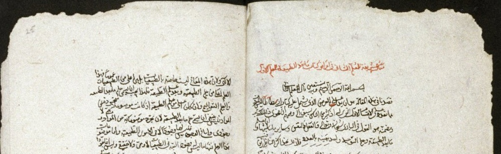

# 📚 Source Analysis Recommender

<div align="center">
  
  
  
  <h2>Computational Approaches to Philosophical Source Analysis</h2>
  
  <p><em>LLM API APPROACH</em></p>
  <p><em>https://github.com/campattison/sourceanalysis</em></p>
  <p>
    <a href="#overview">Overview</a> •
    <a href="#what">Source Analysis</a> •
    <a href="#problem">Problem Statement</a> •
    <a href="#pipeline">Pipeline</a> •
    <a href="#stage1">Thematizer</a> •
    <a href="#stage2">Source Analyzer</a> •
    <a href="#stage3">Deep Analyzer</a> •
    <a href="#significance">Significance</a>
  </p>
  
  <br>
  
  <p><em>Arabic manuscript from Bodleian Library (MS. Arab.d.84)</em></p>
</div> 

---

<a id="overview"></a>
## 🔍 Overview

<div align="center">
  <table>
    <tr>
      <td align="center" width="33%"><h3>🔍 Discover</h3>Hidden textual connections</td>
      <td align="center" width="33%"><h3>🔄 Compare</h3>Cross-linguistic influences</td>
      <td align="center" width="33%"><h3>📊 Analyze</h3>Evidence-based relationships</td>
    </tr>
  </table>
</div>

<br>

The Source Analysis Recommender is a computational pipeline designed to identify and analyze potential source relationships between classical philosophical texts. This system bridges computational linguistics with traditional philological methods to provide evidence-based insights into the transmission of philosophical ideas across linguistic and cultural boundaries, assisting scholars in discovering overlooked textual connections and influences.

This API approach is one of two approaches we're currently working on. The other is a vector store approach that leverages ModernBERT to conduct quantitative research on text similarities between input and database files. 

---
<a id="what"></a>
## 📜 What is Source Analysis?

Source analysis in classical and medieval philosophy examines how philosophical ideas were transmitted, transformed, and developed across time, languages, and cultures. It investigates:

- The textual lineage of philosophical works (which texts influenced others)
- Hidden influences that may not be explicitly acknowledged by authors
- The philosophical context in which a given text should be interpreted
- How concepts and arguments were borrowed, adapted, or critiqued


---

<a id="problem"></a>
## ⚠️ Problem Statement

<table>
  <tr>
    <td width="70%">
      <h3>Challenges in Source Analysis</h3>
      <ul>
        <li><strong>Labor-Intensive Process:</strong> Traditional source analysis is labor-intensive and limited by human capacity to process large text corpora</li>
        <li><strong>Cross-Linguistic Barriers:</strong> Cross-linguistic influences (particularly Greek-Arabic) are understudied due to language barriers</li>
        <li><strong>Hidden Connections:</strong> Many textual relationships remain hidden due to the limitations of manual analysis</li>
        <li><strong>Confirmation Bias:</strong> Manual analysis can be influenced by individual scholar perspectives and preconceptions</li>
        <li><strong>Fragmentary Sources:</strong> Original sources are often fragmentary or lost entirely</li>
        <li><strong>Non-Standard Citations:</strong> Authors frequently didn't cite sources according to modern conventions</li>
      </ul>
      <h3>Our Solution</h3>
      <p>Leverage LLMs (Claude and OpenAI) to do some of the legwork, so that scholars can spend their time more productively</p>
    </td>
    <td width="30%" align="center">
      
      <p><em>Immanuel Bekker (1785-1871)<br>Classical philologist</em></p>
    </td>
  </tr>
</table>

---

<a id="pipeline"></a>
## ⚙️ Three-Stage Pipeline

This system employs a three-stage pipeline that progressively refines the analysis:

<div align="center">
  <table>
    <tr>
      <th width="20%">Stage</th>
      <th width="40%">Focus</th>
      <th width="40%">Output</th>
    </tr>
    <tr>
      <td align="center"><h3>1️⃣</h3><strong>Thematizer</strong></td>
      <td>Individual text analysis</td>
      <td>Thematic profiles</td>
    </tr>
    <tr>
      <td align="center"><h3>2️⃣</h3><strong>Source Analyzer</strong></td>
      <td>Pairwise comparison</td>
      <td>Relationship evidence</td>
    </tr>
    <tr>
      <td align="center"><h3>3️⃣</h3><strong>Deep Analyzer</strong></td>
      <td>In-depth analysis</td>
      <td>Detailed influence assessment</td>
    </tr>
  </table>
</div>

<br>

The following sections demonstrate each stage of the pipeline with concrete examples of inputs, processes, and outputs for each stage, starting with the Thematizer.

---

<a id="stage1"></a>
## 🧠 Stage 1: Thematizer

### Purpose

The Thematizer performs initial broad analysis of individual texts to identify themes, structure, and key concepts. It serves as the foundation for all subsequent analysis by creating comprehensive thematic profiles for each text.

### Database Excerpt: Classical Greek Text (Aristotle)
Abridged for brevity (database contains entire text)
<div align="center">
  <table>
    <tr>
      <td>
        <pre>
Περι ποιητικῆς αὐτῆς τε καὶ τῶν εἰδῶν αὐτῆς, ἥν τινα δύναμιν ἕκαστον ἔχει, καὶ πῶς 
δεῖ συνίστασθαι τοὺς μύθους, εἰ μέλλει καλῶς ἕξειν ἡ ποίησις, ἔτι δὲ ἐκ πόσων καὶ 
ποίων ἐστὶ μορίων, ὁμοίως δὲ καὶ περὶ τῶν ἄλλων ὅσα τῆς αὐτῆς ἐστὶ μεθόδου, λέγωμεν, 
ἀρξάμενοι κατὰ φύσιν πρῶτον ἀπὸ τῶν πρώτων. Ἐποποιία δὴ καὶ ἡ τῆς τραγῳδίας ποίησις, 
ἔτι δὲ κωμῳδία καὶ ἡ διθυραμβοποιητικὴ καὶ τῆς αὐλητικῆς ἡ πλείστη καὶ κιθαριστικῆς, 
πᾶσαι τυγχάνουσιν οὖσαι μιμήσεις τὸ σύνολον.
        </pre>
      </td>
    </tr>
    <tr>
      <td align="center"><em>Classical Greek text from Aristotle's Ars Poetica Περὶ ποιητικῆς Kitāb fī l-šiʿr</em></td>
    </tr>
  </table>
</div>

### Input Excerpt: Classical Arabic Text (Al-Farabi)
Abridged for brevity (database contains entire text)
<div align="center">
  <table>
    <tr>
      <td>
        <pre>
         بسم اللّه الرحمن الرحيم مقالة في قوانين صناعة الشعراء للمعلّم الثاني قال: 
         قصدنا في هذا القول إثبات أقاويل وذكر معانٍ تفضي بمن عرفها إلى الوقوف على ما 
         أثبته الحكيم في صناعة الشعر، من غير أن نقصد إلى استيفاء جميع ما يحتاج إليه 
         في هذه الصناعة وترتيبها، إذ الحكيم لم يكمل القول في صناعة المغالطة فضلاً عن 
         القول في صناعة الشعر، وذلك أنّه لم يجد لمن تقدّمه 
        </pre>
      </td>
    </tr>
    <tr>
      <td align="center"><em>Classical Arabic text from Al-Farabi's Risālah fī qawānīn ṣināʿat al-šuʿarāʾ</em></td>
    </tr>
  </table>
</div>

### Process

The Thematizer follows these steps:

1. **Text Preparation**
   - Ingests raw text files from input and database directories
   - Validates file structure and creates organized directory for outputs
   - Splits large texts into manageable chunks (approximately 20,000 characters)

2. **API Analysis**
   - Processes each text chunk using Claude 3.5 Sonnet
   - Applies specialized prompt engineering for philosophical text analysis
   - Identifies author, title, text type, themes, and structural elements
   - Generates scholarly abstracts for each text chunk

3. **Result Compilation**
   - Merges analyses from multiple chunks with intelligent deduplication
   - Combines abstracts and consolidates themes
   - Identifies natural breaks and section divisions
   - Generates comprehensive thematic profiles

### API Prompt Used
```
You are a Classical scholar specializing in ancient Greek and Arabic philosophy. 
You are analyzing an academic philosophical text that could be:
1. An ancient Greek philosophical work (like Aristotle's originals)
2. An Arabic philosophical text (like Al-Farabi's originals)
3. A commentary or interpretation of philosophical works (like Al-Farabi's 
commentaries)
4. Part of the established philosophical canon

Your task is to perform careful scholarly analysis of this text. Pay special attention to:
- References to authors or titles in the text
- Writing style and terminology that might indicate the text type
- Technical philosophical terms and concepts
- Section breaks or chapter divisions
- The relationship to Aristotelian thought

Please analyze the following chunk ({chunk_number} of {total_chunks}) and extract:

1. Author identification:
   - Look for explicit mentions of the author
   - Carefully consider writing style and historical context
   - Note if it's attributed to a specific philosophical school

2. Title identification:
   - Look for explicit title mentions
   - Consider standard names of philosophical works
   - Note if it's part of a larger work

3. Text type classification:
   - "original text" (e.g., Aristotle's works)
   - "commentary" (direct commentary on another work)
   - "treatise" (independent philosophical work)
   - "unknown" (if unclear)

4. Themes and concepts:
   - Major philosophical themes
   - Technical terminology
   - Key arguments and concepts
   - Philosophical methodology

5. Abstract focusing on:
   - Main philosophical arguments
   - Relationship to other philosophical works
   - Historical and intellectual context
   - Significance of the ideas presented

6. Structural elements:
   - Chapter or section divisions
   - Natural topic transitions
   - Argument structure breaks
   - Reference points in the text


You MUST respond in valid JSON format with these exact fields:
{{
    "author": "Author's name or 'Unknown' if not found in this chunk",
    "title": "Title of the work or 'Unknown' if not found in this chunk",
    "text_type": "original text|commentary|treatise|unknown",
    "themes": ["theme1", "theme2", ...],
    "abstract": "A scholarly abstract of this chunk of text.",
    "natural_breaks": ["Break 1", "Break 2", ...] or [] if none found
}}

```

### Output Example
```
  "author": "Aristotle",
  "title": "Poetics",
  "text_type": "original text",
  "themes": [
    "Classification of poetic forms",
    "Comparison of poetry and history",
    "Dramatic structure",
    "Literary criticism",
    "Nature of tragedy",
    "Poetic composition",
    "Theory of mimesis",
    "Unity of plot",
    "Character development",
    "Dramatic poetry vs epic poetry",
    "Dramatic unity",
    "Epic poetry",
    "Length and composition",
    "Linguistic analysis",
    "Linguistic elements",
    "Literary theory",
    "Metaphor theory",
    "Mimesis",
    "Pleasure in poetry",
    "Plot construction",
    "Recognition (anagnorisis)",
    "Reversal (peripeteia)",
    "Tragedy",
    "Tragedy and epic comparison",
    "Tragedy theory",
    "Unity of action"
  ],
  "abstract": "This is the opening section of Aristotle's Poetics, his foundational 
  treatise on literary theory and dramatic criticism. The text begins with a 
  systematic analysis of different forms of artistic imitation (mimesis), 
  particularly focusing on poetry, tragedy, comedy, and epic poetry. \n\n  Aristotle 
  establishes his key theoretical framework by differentiating various arts according
  to their means, objects, and manner of imitation. He then provides a detailed 
  analysis of tragedy's essential elements, including plot, character, thought, 
  diction, melody, and spectacle. \n\n  The text is particularly significant for its
  formal definition of tragedy and its emphasis on plot (mythos) as the most 
  important element of tragic composition. The work represents the first systematic 
  treatment of literary theory in Western thought. \n\n  This section of 
  Aristotle's Poetics focuses on the technical aspects of tragic drama, 
  particularly analyzing plot structure, character recognition (anagnorisis), and 
  dramatic revers..."
}
```

### Key Features

- **Multilingual Analysis**: Processes texts in Ancient Greek, Classical Arabic, and other languages
- **Intelligent Chunking**: Handles texts of any length by splitting into manageable chunks while preserving context
- **Structured Output**: Generates standardized JSON data for consistent downstream processing

---

<a id="stage2"></a>
## 🔍 Stage 2: Source Analyzer

### Purpose

The Source Analyzer compares texts to identify potential relationships and influences between them. It takes the thematic profiles generated by the Thematizer and performs pairwise comparisons to detect verbal parallels, conceptual similarities, and methodological connections via API calls to Claude 3.5 Sonnet.


### Technical Implementation

The Source Analyzer is implemented as a Python module that:

1. **Loads and Processes Thematic Data**
   - Reads JSON outputs from the Thematizer
   - Identifies potential text pairs for comparison based on thematic overlap

2. **Performs Multi-Stage Analysis**
   - Loads relevant text pairs
   - Conducts in-depth analysis using Claude 3.5 Sonnet API
   - Outputs structured examination of verbal, conceptual, and methodological parallels

3. **Generates Comprehensive Results**
   - Creates standardized JSON output with detailed evidence
   - Estimates confidence scores
   - Produces human-readable summaries with scholarly recommendations

### API Prompts Used

#### Initial Sorting of Texts

```
You are a Classical scholar specializing in ancient Greek and Arabic philosophy.

Based on the following analysis results, determine if these texts are likely to have a meaningful source relationship.

Text 1:
Author: {context['input_author']}
Title: {context['input_title']}
Type: {context['input_type']}
Themes: {', '.join(input_analysis.get('themes', []))}
Abstract: {input_analysis.get('abstract', 'No abstract available')}

Text 2:
Author: {context['db_author']}
Title: {context['db_title']}
Type: {context['db_type']}
Themes: {', '.join(db_analysis.get('themes', []))}
Abstract: {db_analysis.get('abstract', 'No abstract available')}

Respond in this exact JSON format:
{
    "is_relevant": true/false,
    "relevance_score": 0.0-1.0,
    "common_themes": ["theme1", "theme2", ...],
    "rationale": "Brief explanation of why these texts are or aren't relevant"
}
```

#### Source Analysis

```
You are a Classical scholar specializing in ancient Greek and Arabic philosophy. 
You are analyzing two texts for potential source relationships.

Text 1 Context:
Author: {context['input_author']}
Title: {context['input_title']}
Type: {context['input_type']}

Text 2 Context:
Author: {context['db_author']}
Title: {context['db_title']}
Type: {context['db_type']}

Please analyze these texts for:

1. Verbal Parallels:
   - Direct quotations
   - Close paraphrases
   - Shared terminology
   - Similar phrasing

2. Conceptual Parallels:
   - Shared philosophical ideas
   - Similar arguments
   - Related examples
   - Common themes

3. Methodological Parallels:
   - Similar analytical approaches
   - Shared argumentative structures
   - Common organizational patterns
   - Related scholarly methods

4. Technical Vocabulary:
   - Shared philosophical terms
   - Similar technical language
   - Common specialized concepts
   - Related terminological usage

Analyze these texts and respond in this exact JSON format:
{
    "verbal_parallels": ["parallel1", "parallel2", ...],
    "conceptual_parallels": ["parallel1", "parallel2", ...],
    "methodological_parallels": ["parallel1", "parallel2", ...],
    "technical_vocabulary": ["term1", "term2", ...],
    "analysis_summary": "A detailed summary of the relationship between these texts",
    "confidence_score": 0.0-1.0,
    "recommended_research": ["suggestion1", "suggestion2", ...]
}
```

### Output Example: Comparison Analysis

<div align="center">
  <table>
    <tr>
      <td>
        <pre>
{
  "comparisons": [
    {
      "input_file": "farabi.txt",
      "database_file": "ap.txt",
      "relevance_score": 0.9,
      "common_themes": [
        "poetic theory",
        "classification of literary forms",
        "linguistic analysis",
        "systematic analysis of poetry",
        "literary criticism",
        "genre classification",
        "compositional structure"
      ],
      "rationale": "These texts show a clear source relationship, with Al-Farabi's 
      treatise directly building upon Aristotle's Poetics. Both works employ 
      systematic classification of poetic forms and linguistic analysis. Al-Farabi 
      explicitly adapts Aristotelian poetic theory for an Arabic context while 
      maintaining core theoretical frameworks. The strong textual relationship is 
      evident in their shared methodological approach to analyzing poetic discourse, 
      though Al-Farabi expands the comparative scope to include non-Greek traditions. 
      The transmission of Aristotelian poetic theory through Arabic philosophical 
      tradition is well-documented, and this pair of texts represents a classic 
      example of that philosophical lineage.",
      "analysis": {
        "verbal_parallels": [
          "Both texts discuss mimesis/imitation (محاكاة in Arabic, μίμησις in Greek)",
          "Shared terminology around tragedy (τραγῳδία/طراغوذيا) and comedy (κωμῳδία/قوموذيا)",
          "Discussion of poetic meters and rhythm (وزن/μέτρον)",
          "Treatment of diction and language (لفظ/λέξις)"
        ],
        "conceptual_parallels": [
          "Classification of different types of poetry",
          "Theory of poetic imitation and representation",
          "Discussion of plot structure and composition",
          "Analysis of character types and moral qualities",
          "Treatment of probability and necessity in poetry"
        ],
        "methodological_parallels": [
          "Systematic classification of poetic forms",
          "Analysis moving from general principles to specific examples",
          "Use of technical terminology and definitions",
          "Comparative analysis between different poetic genres"
        ],
        "technical_vocabulary": [
          "mimesis/محاكاة/μίμησις",
          "tragedy/طراغوذيا/τραγῳδία",
          "comedy/قوموذيا/κωμῳδία",
          "diction/لفظ/λέξις",
          "plot/مثل/μῦθος"
        ],
        "analysis_summary": "Al-Farabi's text shows clear influence from Aristotle's
         Poetics, adapting Greek poetic theory for an Arabic context. While 
         maintaining core Aristotelian concepts like mimesis and the classification 
         of poetic genres, Al-Farabi develops these ideas within Islamic literary 
         traditions. The parallel structure and shared technical vocabulary 
         demonstrate direct transmission of Aristotelian poetics through Arabic 
         philosophical tradition.",
        "confidence_score": 0.9,
        "recommended_research": [
          "Examine Arabic translations and commentaries of Aristotle's Poetics",
          "Compare Al-Farabi's other works on poetry and rhetoric",
          "Study the transformation of Greek poetic terms in Arabic tradition",
          "Investigate the role of Syriac intermediaries in transmission"
        ]
      }
    }
  ]
}
        </pre>
      </td>
    </tr>
  </table>
</div>

### Key Features

- **Cross-Linguistic Analysis**: Compares texts across different languages and traditions
- **Evidence-Based Assessment**: Provides specific textual evidence for each claim
- **Confidence Scoring**: Quantifies the likelihood of influence on a standardized scale
- **Multi-Dimensional Analysis**: Examines verbal, conceptual, and methodological parallels
- **Historical Contextualization**: Considers known transmission pathways and historical factors

---

<a id="stage3"></a>
## 🔬 Stage 3: Deep Analyzer

### Purpose

The Deep Analyzer performs in-depth analysis of high-confidence matches identified by the Source Analyzer. It focuses on text pairs with high confidence scores (≥0.7) and provides detailed evidence-based assessment of influence patterns.


### Technical Implementation

The Deep Analyzer is implemented as a Python module that:

1. **Loads Source Analyzer Results**
   - Retrieves the latest analysis results
   - Filters for high-confidence matches (≥0.7)

2. **Makes API Calls to OpenAI**
   - Uses the o3-mini model
   - Implements retry logic for reliability
   - Processes structured JSON responses

3. **Performs Three Types of Analysis**
   - Transmission pattern analysis
   - Philosophical development analysis
   - Linguistic transformation analysis

4. **Generates Detailed Reports**
   - Creates comprehensive analysis reports
   - Saves results with timestamps
   - Maintains symlinks to latest results

### API Prompt Example

```
Analyze the textual evidence for transmission and influence between these texts:

Text 1:
Author: {input_metadata.get('author', 'Unknown')}
Title: {input_metadata.get('title', 'Unknown')}
Type: {input_metadata.get('text_type', 'Unknown')}

Text 2:
Database Text: {comparison['database_file']}

Existing Analysis:
{json.dumps(comparison['analysis'], indent=2)}

Please analyze the concrete textual evidence for:
1. Direct textual dependencies:
   - Exact quotations or close paraphrases
   - Shared examples or illustrations
   - Similar structural organization
   - Common reference points

2. Conceptual dependencies:
   - Shared philosophical frameworks
   - Similar problem-solving approaches
   - Common argumentative patterns
   - Parallel theoretical constructs

3. Evidence of mediation:
   - References to other texts or authorities
   - Use of standard terminology or definitions
   - Common sources cited or alluded to
   - Shared technical vocabulary

4. Adaptation indicators:
   - Modifications of concepts or arguments
   - Contextual adjustments
   - Elaborations or simplifications
   - Novel applications of ideas

Focus only on evidence present in the texts themselves. Avoid speculating about 
historical transmission paths unless explicitly referenced in the texts.

Respond in JSON format with these fields:
{
    "textual_dependencies": ["dependency1", "dependency2", ...],
    "conceptual_dependencies": ["dependency1", "dependency2", ...],
    "mediation_evidence": ["evidence1", "evidence2", ...],
    "adaptation_evidence": ["evidence1", "evidence2", ...],
    "evidence_strength": 0.0-1.0,
    "key_passages": ["passage1", "passage2", ...]
}
```

### Output Example
Raw output:
```
  "analyses": [
    {
      "input_file": "farabi.txt",
      "database_file": "ap.txt",
      "original_confidence": 0.9,
      "transmission_analysis": {
        "textual_dependencies": [
          "Both texts include nearly identical technical terms such as mimesis/imitation (Arabic: محاكاة, Greek: μίμησις) and use them in definitions that match closely.",
          "There is strong evidence in both texts for a parallel discussion of dramatic genres, as shown by the use of terms for tragedy (Arabic: طراغوذيا, Greek: τραγωδία) and comedy (Arabic: قواموذيا, Greek: κωμῳδία).",
          "Both texts systematically enumerate elements of poetic construction—addressing poetic meters and rhythm (Arabic: وزن, Greek: μέτρον) as well as diction (Arabic: لفض, Greek: λέξις) and plot (Arabic: مثل, Greek: μῦθος)—demonstrating close paraphrasing and organization.",
          "The structural organization in both texts follows a similar progression from general theoretical principles to specific illustrative examples."
        ],
        "conceptual_dependencies": [
          "Both texts operate within a shared philosophical framework that classifies different types of poetry and examines the nature of imitation (mimesis) as a central principle.",
          "The texts share a methodological approach that begins with broad definitions and theoretical constructs before applying them to analyze specific aspects of poetry.",
          "Each text makes use of comparative analysis between poetic genres (tragedy versus comedy) and dissects components such as plot structure and character types within the same theoretical models.",
          "Common argumentative patterns appear in their handling of probability, necessity, and the moral underpinnings of literary expression."
        ],
        "mediation_evidence": [
          "Both texts consistently employ a standard set of technical vocabulary which is characteristic of classical poetics (e.g., mimesis, tragedy, comedy, diction, plot), implying a reliance on shared authoritative sources.",
          "There is evidence of citation or allusion to established frameworks typical of classical works (as exemplified by the consistency with Aristotelian terms), even if Aristotle’s name is not explicitly mentioned in all instances.",
          "The texts refer to paradigmatic examples and definitions that indicate the use of a common intermediary tradition, such as translations or commentaries that standardize the terminology across cultures."
        ],
        "adaptation_evidence": [
          "The Arabic text adapts the Greek concepts by reinterpreting or extending definitions to align with an Islamic literary framework, as seen in adjustments to the classification of poetic genres.",
          "Modifications are evident where the Arabic treatment provides contextual adjustments—using local examples and elaborating on certain technical terms (for instance, a more locally relevant treatment of poetic meters) that differ slightly from the Greek formulations.",
          "There are instances of simplification or elaboration in the exposition of arguments, suggesting that while the Greek structure is maintained, the presentation is modified to suit a different cultural or linguistic audience.",
          "The adaptation appears in the comparative structure: while both texts share the same basic layout for analysis, the Arabic text selectively refines aspects (such as ethical considerations in character analysis) to resonate with its audience."
        ],
        "evidence_strength": 0.9,
        "key_passages": [
          "The section where both texts define mimesis/imitation explicitly—Arabic: 'محاكاة' is defined in a manner nearly identical to the Greek 'μίμησις'.",
          "Passages devoted to the classification of dramatic genres, where both languages provide parallel definitions and examples for tragedy and comedy.",
          "The analysis of poetic rhythm and meter which juxtaposes the Arabic 'وزن' with the Greek 'μέτρον', showcasing a direct correspondence in technical detail.",
          "Excerpts on the discussion of diction and plot structure that reveal congruent methodological approaches and identical use of technical vocabulary."
        ]
      },
      "philosophical_analysis": {
        "argument_analysis": [
          "Both texts construct their arguments by first establishing general principles (such as the concept of mimesis/imitative art) and then applying these principles to specific categories (like tragedy versus comedy).",
          "The Greek text reveals a framework based on rigorous syllogistic and deductive reasoning, emphasizing logical relationships among defined terms, while the Arabic text follows a similar pattern but modifies certain argumentative steps to fit its own cultural and literary contexts.",
          "Each text utilizes precise technical vocabulary (for example, in defining poetic metrics, diction, and plot structure) to build their arguments, demonstrating a methodological consistency in using specialized terminology as a basis for subsequent analysis."
        ],
        "conceptual_analysis": [
          "Both texts share key philosophical concepts such as mimesis (imitation), the classification of poetic forms, and the analysis of tragedy and comedy, each using analogous terminology in Arabic and Greek.",
          "The Greek text lays out a categorical system that dissects poetic art into its constituent elements, while the Arabic text extends these categories by integrating additional considerations (for instance, moral qualities and probability in narrative outcomes) that reflect its specific intellectual milieu.",
          "While both texts adhere to an ontological framework that distinguishes various forms of artistic representation, the Arabic text innovatively reframes these categories to resonate with Islamic literary and philosophical traditions."
        ],
        "methodological_analysis": [
          "Both texts demonstrate a systematic analytical technique in which broad definitions and principles are apportioned into more specific subcategories, an approach that reflects a shared methodological focus on comparative classification.",
          "The investigative method employed in both works involves detailed analysis using technical terms and clear examples to illustrate how different poetic genres function, revealing an underlying commitment to precise definition and empirical illustration.",
          "Dialectical patterns are observed in the way each text contrasts genres—such as tragedy versus comedy—and uses structured demonstrations to reconcile differences and similarities among these categories."
        ],
        "innovation_evidence": [
          "The Arabic text extends the classical framework by incorporating additional dimensions—such as moral evaluation and the assessment of probability and necessity in poetry—that are not as prominent in the Greek presentation.",
          "A novel application is seen in how the Arabic text adapts Greek technical vocabulary to fit an Islamic literary context, effectively synthesizing traditional Aristotelian poetics with new cultural and philosophical insights.",
          "There is clear evidence of refined argumentation in the Arabic text, as it not only borrows from the Greek model but also reconstructs the theoretical constructs to address literary concerns unique to its own tradition."
        ],
        "evidence_strength": 0.9,
        "key_arguments": [
          "The argument establishing mimesis as a universal principle in poetic theory is consistently articulated in both texts, demonstrating a shared belief in the function of imitation as a creative act.",
          "Both texts articulate detailed classifications of poetic genres, particularly in their treatment of tragedy and comedy, using parallel technical vocabulary that underscores their common analytical heritage.",
          "The Greek text’s structured approach to defining poetic elements (using syllogistic and deductive reasoning) is mirrored and extended by the Arabic text, where the core principles are maintained but are innovatively adapted to include additional literary and moral dimensions."
        ]
      },
      "linguistic_analysis": {
        "technical_analysis": [
          "Both texts (or at least the available portion of Text 2 and the inferred content of Text 1) display a methodical listing of technical terminology. For example, the term 'mimesis' is presented alongside its Arabic (مُحاكاة) and Greek (μίμησις) equivalents, demonstrating a clear cross-linguistic mapping of concepts.",
          "Similarly, the terms 'tragedy,' 'comedy,' 'diction,' and 'plot' are each given in three linguistic forms. This indicates that both texts use standardized technical vocabulary from literary theory and philosophy, and that these terms are understood as carrying a specialized meaning in each language."
        ],
        "argumentative_analysis": [
          "Although neither text presents a fully elaborated argument in the excerpt provided, the manner of juxtaposing equivalent terms implies an underlying dialectical strategy.",
          "The consistent listing with clear separators (slashes) between the linguistic forms (for instance, 'mimesis/مُحاكاة/μίμησις') works as a demonstrative device that argues for the equivalence of these concepts across cultures and languages.",
          "Such systematic pairing may function as an inferential marker by suggesting that if one understands the Greek technical term, then one can also comprehend its Arabic and English (or classical) counterparts."
        ],
        "conceptual_expression": [
          "The texts express abstract philosophical concepts using technical terms that are common to literary and aesthetic theory. Terms like 'mimesis' and 'plot' signal deep theoretical ideas about art imitation and narrative structure.",
          "By aligning terms such as 'tragedy' and 'comedy' with their equivalents in different languages, the texts show a definitional approach that binds these abstract categories with specific, culturally informed vocabularies.",
          "The act of listing these high-level concepts side by side serves as an explanatory pattern: it illuminates the shared conceptual ground between different philosophical traditions."
        ],
        "organizational_patterns": [
          "The texts exhibit a clear, list-based organizational structure. In Text 2, each technical term is followed by its corresponding translations separated by slashes (e.g., 'diction/لفظ/λέξις'), indicating an intentional internal organization aimed at parallelism across languages.",
          "This structure not only serves a reference function but also emphasizes cross-linguistic consistency in how technical terms are used, suggesting an underlying intertextual dialogue.",
          "While Text 1’s organization is less explicit in what is provided, the shared use of technical vocabulary implies that similar internal organization mechanisms (such as sections or lists of definitional paragraphs) might be in place."
        ],
        "evidence_strength": 0.75,
        "key_terminology": {
          "mimesis": {
            "English": "mimesis",
            "Arabic": "مُحاكاة",
            "Greek": "μίμησις"
          },
          "tragedy": {
            "English": "tragedy",
            "Arabic": "طراغوذيا",
            "Greek": "τραγῳδία"
          },
          "comedy": {
            "English": "comedy",
            "Arabic": "قوْموذيا",
            "Greek": "κωμῳδία"
          },
          "diction": {
            "English": "diction",
            "Arabic": "لفظ",
            "Greek": "λέξις"
          },
          "plot": {
            "English": "plot",
            "Arabic": "مثَل",
            "Greek": "μύθος"
          }
        },
        "specific_examples": [
          "Example of shared technical terminology: 'mimesis/مُحاكاة/μίμησις' directly aligns a concept across English, Arabic, and Greek.",
          "Example of argumentative implication: The consistent slash-delimited format (as in 'tragedy/طراغوذيا/τραγῳδία') functions as an inferential marker that what is true for one term is true for its translation, thereby arguing for conceptual equivalence.",
          "Example of conceptual expression: Presenting 'plot' as 'plot/مثَل/μύθος' encapsulates a complex narrative idea in a simple tripartite form, underlining its philosophical and literary importance.",
          "Example of organizational pattern: The list format in Text 2 organizes terms systematically, which not only aids in comparison but also suggests a deliberate effort to structure the text into clearly defined lexical-technical sections."
        ]
      },
      "aggregate_confidence": 0.85
    },
```


The Deep Analyzer generates a structured report with detailed findings:

```
DEEP ANALYSIS REPORT
====================

Analysis Date: 2023-10-15 14:30:22
Total Pairs Analyzed: 3
Successful Analyses: 3
Failed Analyses: 0

ANALYSIS 1
---------------
Input Text: farabi.txt
Database Text: ap.txt
Original Confidence: 0.900
Aggregate Evidence Strength: 0.850

Textual Dependencies and Transmission:
--------------------------------
Direct Textual Dependencies:
  • Both texts include nearly identical technical terms such as mimesis/imitation 
  (Arabic: محاكاة, Greek: μίμησις) and use them in definitions that match closely.
  • There is strong evidence in both texts for a parallel discussion of dramatic 
  genres, as shown by the use of terms for tragedy (Arabic: طراغوذيا, Greek: τραγωδία) and comedy (Arabic: قواموذيا, Greek: κωμῳδία).
  • Both texts systematically enumerate elements of poetic construction—addressing 
  poetic meters and rhythm (Arabic: وزن, Greek: μέτρον) as well as diction (Arabic: 
  لفض, Greek: λέξις) and plot (Arabic: مثل, Greek: μῦθος)—demonstrating close 
  paraphrasing and organization.
  • The structural organization in both texts follows a similar progression from 
  general theoretical principles to specific illustrative examples.

Conceptual Dependencies:
  • Both texts operate within a shared philosophical framework that classifies 
  different types of poetry and examines the nature of imitation (mimesis) as a 
  central principle.
  • The texts share a methodological approach that begins with broad definitions and 
  theoretical constructs before applying them to analyze specific aspects of poetry.
  • Each text makes use of comparative analysis between poetic genres (tragedy versus 
  comedy) and dissects components such as plot structure and character types within 
  the same theoretical models.
  • Common argumentative patterns appear in their handling of probability, necessity,
   and the moral underpinnings of literary expression.

Key Supporting Passages:
  • The section where both texts define mimesis/imitation explicitly—Arabic: 'محاكاة'
   is defined in a manner nearly identical to the Greek 'μίμησις'.
  • Passages devoted to the classification of dramatic genres, where both languages 
  provide parallel definitions and examples for tragedy and comedy.
  • The analysis of poetic rhythm and meter which juxtaposes the Arabic 'وزن' with 
  the Greek 'μέτρον', showcasing a direct correspondence in technical detail.
  • Excerpts on the discussion of diction and plot structure that reveal congruent 
  methodological approaches and identical use of technical vocabulary.

Philosophical Analysis:
---------------------
Argument Structure:
  • Both texts construct their arguments by first establishing general principles 
  (such as the concept of mimesis/imitative art) and then applying these principles 
  to specific categories (like tragedy versus comedy).
  • The Greek text reveals a framework based on rigorous syllogistic and deductive 
  reasoning, emphasizing logical relationships among defined terms, while the Arabic 
  text follows a similar pattern but modifies certain argumentative steps to fit its 
  own cultural and literary contexts.
  • Each text utilizes precise technical vocabulary (for example, in defining poetic 
  metrics, diction, and plot structure) to build their arguments, demonstrating a 
  methodological consistency in using specialized terminology as a basis for 
  subsequent analysis.

Key Philosophical Concepts:
  • Both texts share key philosophical concepts such as mimesis (imitation), the 
  classification of poetic forms, and the analysis of tragedy and comedy, each using 
  analogous terminology in Arabic and Greek.
  • The Greek text lays out a categorical system that dissects poetic art into its 
  constituent elements, while the Arabic text extends these categories by integrating 
  additional considerations (for instance, moral qualities and probability in 
  narrative outcomes) that reflect its specific intellectual milieu.
  • While both texts adhere to an ontological framework that distinguishes various 
  forms of artistic representation, the Arabic text innovatively reframes these 
  categories to resonate with Islamic literary and philosophical traditions.

Methodological Approaches:
  • Both texts demonstrate a systematic analytical technique in which broad 
  definitions and principles are apportioned into more specific subcategories, an 
  approach that reflects a shared methodological focus on comparative classification.
  • The investigative method employed in both works involves detailed analysis using 
  technical terms and clear examples to illustrate how different poetic genres 
  function, revealing an underlying commitment to precise definition and empirical 
  illustration.
  • Dialectical patterns are observed in the way each text contrasts genres—such as 
  tragedy versus comedy—and uses structured demonstrations to reconcile differences 
  and similarities among these categories.

Key Arguments:
  • The argument establishing mimesis as a universal principle in poetic theory is 
  consistently articulated in both texts, demonstrating a shared belief in the 
  function of imitation as a creative act.
  • Both texts articulate detailed classifications of poetic genres, particularly in 
  their treatment of tragedy and comedy, using parallel technical vocabulary that 
  underscores their common analytical heritage.
  • The Greek text's structured approach to defining poetic elements (using 
  syllogistic and deductive reasoning) is mirrored and extended by the Arabic text, 
  where the core principles are maintained but are innovatively adapted to include 
  additional literary and moral dimensions.

Linguistic Analysis:
------------------
Technical Terminology:
  • Both texts (or at least the available portion of Text 2 and the inferred content 
  of Text 1) display a methodical listing of technical terminology. For example, the 
  term 'mimesis' is presented alongside its Arabic (مُحاكاة) and Greek (μίμησις) 
  equivalents, demonstrating a clear cross-linguistic mapping of concepts.
  • Similarly, the terms 'tragedy,' 'comedy,' 'diction,' and 'plot' are each given in 
  three linguistic forms. This indicates that both texts use standardized technical 
  vocabulary from literary theory and philosophy, and that these terms are understood 
  as carrying a specialized meaning in each language.

Argumentative Patterns:
  • Although neither text presents a fully elaborated argument in the excerpt 
  provided, the manner of juxtaposing equivalent terms implies an underlying 
  dialectical strategy.
  • The consistent listing with clear separators (slashes) between the linguistic 
  forms (for instance, 'mimesis/مُحاكاة/μίμησις') works as a demonstrative device 
  that argues for the equivalence of these concepts across cultures and languages.
  • Such systematic pairing may function as an inferential marker by suggesting that 
  if one understands the Greek technical term, then one can also comprehend its 
  Arabic and English (or classical) counterparts.

Conceptual Expression:
  • The texts express abstract philosophical concepts using technical terms that are 
  common to literary and aesthetic theory. Terms like 'mimesis' and 'plot' signal 
  deep theoretical ideas about art imitation and narrative structure.
  • By aligning terms such as 'tragedy' and 'comedy' with their equivalents in 
  different languages, the texts show a definitional approach that binds these 
  abstract categories with specific, culturally informed vocabularies.
  • The act of listing these high-level concepts side by side serves as an 
  explanatory pattern: it illuminates the shared conceptual ground between different 
  philosophical traditions.

Specific Examples:
  • Example of shared technical terminology: 'mimesis/مُحاكاة/μίμησις' directly 
  aligns a concept across English, Arabic, and Greek.
  • Example of argumentative implication: The consistent slash-delimited format (as 
  in 'tragedy/طراغوذيا/τραγῳδία') functions as an inferential marker that what is 
  true for one term is true for its translation, thereby arguing for conceptual 
  equivalence.
  • Example of conceptual expression: Presenting 'plot' as 'plot/مثَل/μύθος' 
  encapsulates a complex narrative idea in a simple tripartite form, underlining its 
  philosophical and literary importance.
  • Example of organizational pattern: The list format in Text 2 organizes terms 
  systematically, which not only aids in comparison but also suggests a deliberate 
  effort to structure the text into clearly defined lexical-technical sections.
```

### Key Features

The Deep Analyzer provides:

1. **Readable Assessment**: Detailed and readable assements of parallels found in the databse
2. **Multi-Dimensional Analysis**: Examines textual, philosophical, and linguistic dimensions
3. **Promising Leads and Context**: Gives scholars a starting point for digging deeper into their literature
4. **Structured Reporting**: Organizes findings into clear categories with specific examples

---

<a id="significance"></a>
## 🌟 Significance for Humanities

<table>
  <tr>
    <td align="center" width="33%">
      <h4>📚 Enhanced Research</h4>
      <ul>
        <li>Process large text volumes</li>
        <li>Identify hidden connections</li>
        <li>Cross-linguistic analysis</li>
      </ul>
    </td>
    <td align="center" width="33%">
      <h4>🔄 Methodological Innovation</h4>
      <ul>
        <li>Bridge computational linguistics with traditional philology</li>
        <li>Combine quantitative + qualitative insights</li>
        <li>Reduce confirmation bias in source identification</li>
      </ul>
    </td>
    <td align="center" width="33%">
      <h4>🌐 New Directions</h4>
      <ul>
        <li>Map influence networks</li>
        <li>Test transmission hypotheses</li>
        <li>Analyze philosophical idea evolution</li>
      </ul>
    </td>
  </tr>
</table>

---

<a id="limitations"></a>
## ⚠️ Limitations and Challenges

<table>
  <tr>
    <td align="center" width="33%">
      <h3>⚠️ AI Limitations</h3>
      <ul>
        <li>Requires expert validation</li>
        <li>Produces qualitative, rather than quantitative analyses</li>
      </ul>
    </td>
    <td align="center" width="33%">
      <h3>📊 Data Challenges</h3>
      <ul>
        <li>Limited digitized medieval texts</li>
        <li>Textual variants and translations</li>
      </ul>
    </td>
    <td align="center" width="33%">
      <h3>🔍 Methodological Considerations</h3>
      <ul>
        <li>Efficiency vs. depth balance</li>
        <li>API cost balancing</li>
      </ul>
    </td>
  </tr>
</table>

---

<a id="future"></a>
## 🚀 Future Directions

<table>
  <tr>
    <td align="center" width="33%">
      <h3>🔧 Technical Enhancements</h3>
      <ul>
        <li>Specialized language models</li>
        <li>Influence network visualization</li>
        <li>Enhanced cross-linguistic capabilities</li>
      </ul>
    </td>
    <td align="center" width="33%">
      <h3>📚 Scholarly Applications</h3>
      <ul>
        <li>Additional philosophical traditions</li>
        <li>Concept evolution analysis</li>
        <li>Collaborative AI-assisted platforms</li>
      </ul>
    </td>
    <td align="center" width="33%">
      <h3>🌉 Interdisciplinary Opportunities</h3>
      <ul>
        <li>Computational linguistics + classics</li>
        <li>Shared humanities computing methods</li>
        <li>Computational philosophy standards</li>
      </ul>
    </td>
  </tr>
</table>

---

<a id="conclusion"></a>
## 🏆 Conclusion

The Source Analysis Recommender represents a significant step forward in computational approaches to philosophical text analysis. By combining the strengths of AI with traditional scholarly methods, it offers new possibilities for understanding the complex relationships between texts across time, language, and tradition.

This project demonstrates the potential of thoughtful AI integration in humanities research—not replacing human scholars, but augmenting their capabilities and opening new avenues for discovery.

---

<div align="center">
  <h2>Thank You</h2>
  <p>For more information about this project, please contact:</p>
  <div style="padding: 20px; margin-top: 10px;">
    <p><strong>Cameron Pattison</strong><br>
    [Vanderbilt University]<br>
    [cameron.pattison@vanderbilt.edu]</p>
  </div>
  
  <p style="margin-top: 30px; font-size: 0.8em; color: #666;">
    © 2025 Source Analysis Recommender Project • All Rights Reserved
  </p>
</div> 
